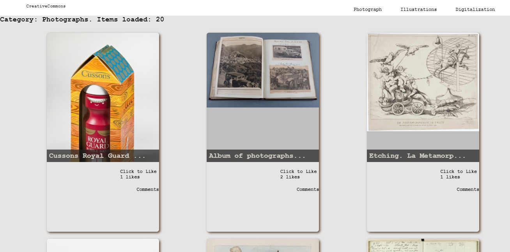

# CreativeCommons

> This website App displays items information from Creative Commons. It also allows users to submit their comments and likes for their favorite item. All data is preserved, thanks to the external API, and involvement API

## Built With
- Javascript
- Html
- Css
- Jest
- Webpack

## Live demo
[LiveLink](https://github.com/M0rrighan/JS-capstone-project-CreativeCommons/dist/)

## Getting Started
To get a local copy of this project, follow these simple steps:
- Clone this clone this repo by typing: `git clone https://github.com/M0rrighan/JS-capstone-project-CreativeCommons`.git`, on your local terminal
- Run `cd <name of the folder>` to access the project folder

## To make the project run in your local machine
- You will need to set up or install webpack in your machine. Open the link bellow for set up
- `https://webpack.js.org/guides/getting-started/#basic-setup`

## Installation of Packages.Json
 Run the code bellow inside your terminal to install Packages.Json in your local machine.
- npm install --save-dev stylelint stylelint-config-standard
- {
  "extends": "stylelint-config-standard"
}
- npx stylelint "**/*.css"

### Prerequisites
- Text editor
- Git
- Html
- CSS
- Js
- webpack

## Authors

👤 **Radmila M0rrighan**  
- GitHub: [@M0rrighan](https://github.com/M0rrighan)
- Twitter: [@RadmilaStojceva](https://twitter.com/RadmilaStojceva)
- LinkedIn: [LinkedIn](https://www.linkedin.com/in/radmila-stojceva-71a838212/)

👤 **Lilian Francis**
- GitHub: [@lilyfrancis](https://github.com/lilyfrancis)
- Twitter: [@lilyfrancis](https://twitter.com/ifnotlily)
- LinkedIn: [LinkedIn](https://www.linkedin.com/in/lilianfrancis/)

## 🤝 Contributing

Contributions, issues and feature requests are welcome!

Feel free to check the [issues page]().

## Show your support

Give a ⭐️ if you like this project!

## Acknowledgments

- Hat tip to anyone whose code was used
- Inspiration
- etc

## 📝 License

This project is [MIT](./MIT.md) licensed.
